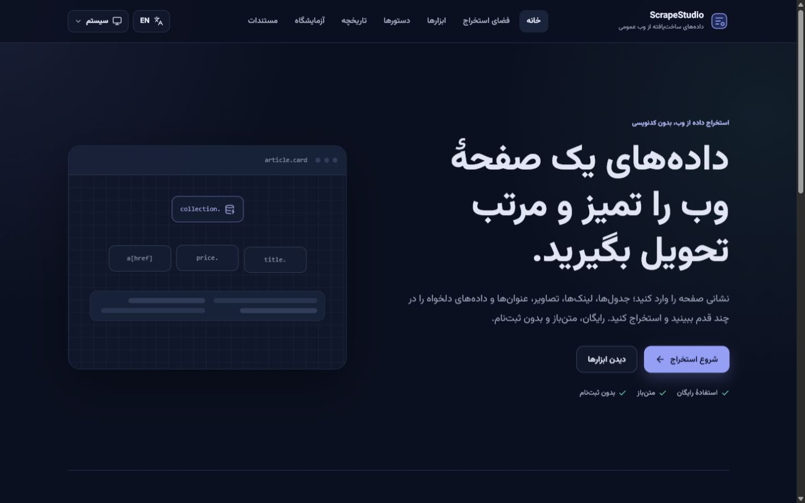
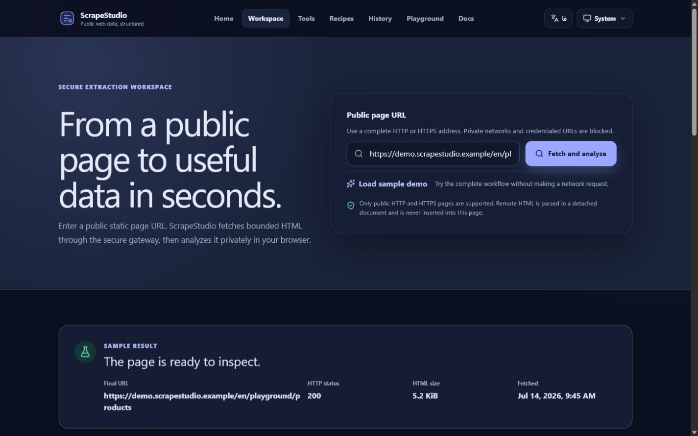
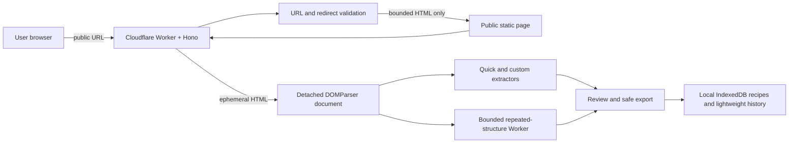

# ScrapeStudio

[](https://github.com/pooya-fr00/ScrapeStudio/actions/workflows/ci.yml)
[](LICENSE)

ScrapeStudio is a free, open-source, bilingual no-code studio for extracting structured data from supported public static web pages.

It combines a security-focused fetch gateway with detached browser-side parsing, editable multi-field recipes, safe exports, local history, starter-code generation, and bounded repeated-structure detection. No account is required.

> **Release status:** the free public release is live at [scrapestudio.pages.dev](https://scrapestudio.pages.dev/en), backed by the guarded Cloudflare Worker deployment documented in this repository.

Designed and built by [Pouya Fereydouni](https://github.com/pooya-fr00) as a production-minded full-stack portfolio project.

## Product preview





## The problem

Useful data is often present in ordinary public HTML, but extracting it still tends to require one of two poor fits:

- a developer tool that assumes scraping and selector knowledge; or
- a hosted service that introduces accounts, remote data storage, opaque limits, or unnecessary automation.

ScrapeStudio provides a smaller and more transparent path: securely retrieve bounded static HTML, analyze it in the browser, review the result, and export only what is needed.

## What it can do

- Extract tables, links, images, headings, document metadata, JSON-LD, and page statistics.
- Build multi-field CSS selector recipes with eight extraction modes and live match counts.
- Detect promising repeated structures in a bounded Web Worker and turn them into editable recipes.
- Export stable JSON and UTF-8 CSV with spreadsheet-formula mitigation.
- Generate starter Python or JavaScript/Node code from an active recipe.
- Save recipes and lightweight history locally in IndexedDB.
- Switch between Persian RTL and English LTR without reloading.
- Present dedicated mobile result cards instead of compressing desktop tables.
- Test everything against original bundled product, table, and article playground pages.

## Built-in playground

The playground is the fastest way to review ScrapeStudio without relying on an external website or consuming public fetch quota:

- `/en/playground/products` and `/fa/playground/products` — twelve repeated product cards;
- `/en/playground/table` and `/fa/playground/table` — an eight-row community schedule;
- `/en/playground/article` and `/fa/playground/article` — headings, prose, metadata, an image record, a link, and JSON-LD.

Each visible demo can load the same bundled semantic HTML directly into the workspace with no network request. See [Playground and public documentation](docs/PLAYGROUND_AND_PUBLIC_DOCS.md).

## Architecture



The backend owns the security-sensitive network boundary. General DOM parsing and repeated-structure analysis stay client-side. Fetched HTML is not persisted by the server and is never injected into the live application DOM.

## Security boundary

The public fetcher enforces:

- HTTP and HTTPS only;
- no embedded URL credentials;
- blocked localhost, private/reserved networks, and cloud metadata targets;
- restricted ports and manual validation of every redirect;
- one overall timeout, a response-size ceiling, and HTML-only content types;
- anonymous short-window and daily limits;
- privacy-safe logging without full sensitive query strings.

ScrapeStudio does not provide credentialed scraping, private-page access, CAPTCHA bypass, anti-bot bypass, proxy rotation, cookie import, arbitrary browser automation, or unlimited crawling. Read [SECURITY.md](SECURITY.md) and the in-product `/en/security` or `/fa/security` page for details.

## Privacy and local data

- Fetched HTML is ephemeral and is not stored by the server.
- Result rows are not written to history.
- Recipes and lightweight activity history stay in the current browser.
- There is no account database in the current release.
- Recipe JSON is the portable backup format.

## Technology

- React 19, TypeScript, Vite, React Router, i18next
- Cloudflare Workers, Hono, Zod, SQLite-backed Durable Objects
- Framework-independent extraction and code-generation packages
- Vitest, Testing Library, ESLint, Prettier, GitHub Actions
- Self-hosted Vazirmatn variable font for the Persian interface

## Run locally

Requirements: Node.js 24 or newer and pnpm 11.7 or newer.

```bash
corepack enable
pnpm install
pnpm --filter @scrapestudio/api dev
pnpm --filter @scrapestudio/web dev
```

Default local services:

- web application: `http://127.0.0.1:5173/en` or `http://127.0.0.1:5173/fa`;
- Worker API health: `http://127.0.0.1:8787/api/v1/health`.

The web development server proxies API requests to the local Worker. Use the playground if you want a deterministic no-network product review.

## Quality gate

```bash
pnpm check
```

The combined gate rejects private/environment files, validates the manual-only deployment policy and browser security policy, checks documentation and formatting, runs lint and strict TypeScript validation, executes unit, integration, E2E, and accessibility tests, audits dependencies, builds every workspace package, and enforces bundle budgets. The Worker build is a Wrangler dry run and does not deploy.

## Repository map

```text
apps/web                 React application, local playground, and browser workflows
apps/api                 Hono Worker and anonymous Durable Object quotas
packages/extraction-core Detached parsing, quick/custom extraction, repeated structures
packages/code-generator  Python and JavaScript starter templates
packages/shared          Shared API contracts and limits
docs                     Architecture and implementation records
tests/fixtures           Original deterministic HTML fixtures
```

Start with:

- [Implementation status](docs/IMPLEMENTATION_STATUS.md)
- [Production deployment and operations](docs/DEPLOYMENT.md)
- [Release history](CHANGELOG.md)
- [Master specification](SCRAPESTUDIO_MASTER_SPEC.md)
- [Secure fetch architecture](docs/SECURE_FETCH.md)
- [Extraction core](docs/EXTRACTION_CORE.md)
- [Local data and export](docs/LOCAL_DATA_AND_EXPORT.md)
- [Smart repeated structures](docs/SMART_REPEATED_STRUCTURES.md)
- [Code generator](docs/CODE_GENERATOR.md)

## Live demo

- [Open ScrapeStudio in English](https://scrapestudio.pages.dev/en)
- [باز کردن ScrapeStudio به فارسی](https://scrapestudio.pages.dev/fa)
- [Open the product playground](https://scrapestudio.pages.dev/en/playground/products)
- [Check the public API health endpoint](https://scrapestudio-api.pooya-fr2005.workers.dev/api/v1/health)

Production uses an exact-origin CSP and CORS allowlist. Deployment remains manual and protected by the GitHub `production` environment, the complete quality gate, and post-deploy live smoke tests.

## Responsible use

Use ScrapeStudio only for public pages you are allowed to access. Keep collection proportionate, respect source-site rules and applicable law, avoid unnecessary personal or sensitive data, and verify extracted records before publishing or relying on them.

## Contributing and license

See [CONTRIBUTING.md](CONTRIBUTING.md) for the local workflow, [CODE_OF_CONDUCT.md](CODE_OF_CONDUCT.md) for community expectations, and [SECURITY.md](SECURITY.md) for responsible vulnerability reporting.

Before publishing, follow the [hardening baseline](docs/HARDENING.md) and the owner-approved [release checklist](docs/RELEASE_CHECKLIST.md).

ScrapeStudio is available under the [MIT License](LICENSE).
